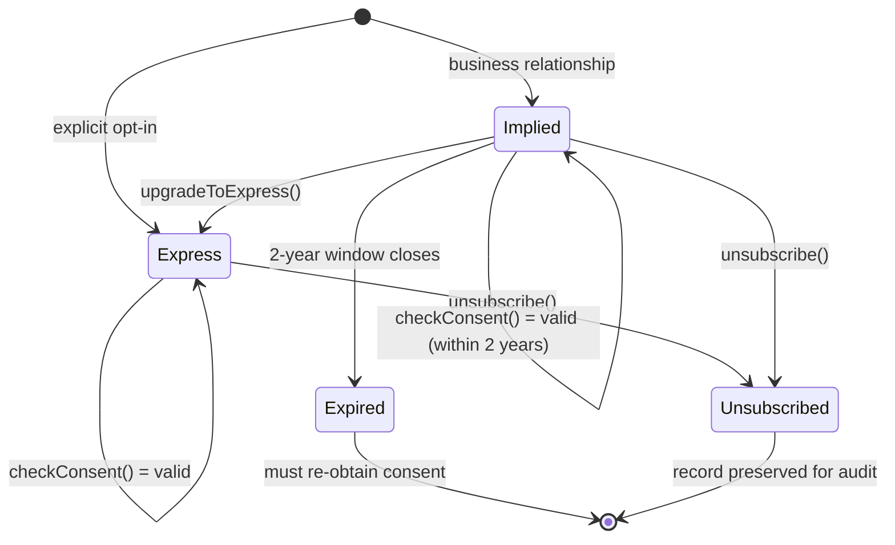

<div align="center">


</div>

# casl-consent

Canadian Anti-Spam Legislation (CASL) consent management for email marketing systems.

[](LICENSE)
[](https://www.typescriptlang.org/)
[](https://github.com/protectyr-labs/casl-consent/actions)
[]()
[](https://vitest.dev)

CASL violations carry penalties up to $10 million per occurrence. This library encodes the consent rules directly so your application cannot accidentally send to expired or unsubscribed recipients. Express consent lasts indefinitely until unsubscribe. Implied consent expires after exactly 2 years per Section 10(2). Every email gets a compliant footer and RFC 8058 one-click unsubscribe headers. Zero dependencies, pure functions, immutable records.

## Quick start

```bash
npm install @protectyr-labs/casl-consent
```

```typescript
import {
  createConsent,
  checkConsent,
  generateFooter,
  generateUnsubscribeHeaders,
} from '@protectyr-labs/casl-consent';

// Implied consent from a purchase -- expires in exactly 2 years (CASL S.10(2))
const consent = createConsent('user-456', 'implied', 'product_purchase');

// Check before every send
const check = checkConsent(consent);
// => { consented: true }

// 2 years later...
const expired = checkConsent(consent, new Date('2028-04-12'));
// => { consented: false, reason: 'Implied consent expired' }

// Compliant email footer + one-click unsubscribe headers
const footer = generateFooter({
  businessName: 'Acme Inc.',
  physicalAddress: '123 Main St, Toronto',
  unsubscribeUrl: 'https://...',
});
const headers = generateUnsubscribeHeaders('https://example.com/unsubscribe?token=abc');
// => { 'List-Unsubscribe': '<https://...>', 'List-Unsubscribe-Post': 'List-Unsubscribe=One-Click' }
```

## Architecture



The state machine has two entry points (express opt-in and implied business relationship) and two terminal states (expired and unsubscribed). The key transition is that implied consent has a hard 2-year expiry enforced by CASL Section 10(2), while express consent persists indefinitely until the recipient unsubscribes. The `upgradeToExpress()` function provides a one-way path from implied to express, removing the expiry constraint.

See [ARCHITECTURE.md](ARCHITECTURE.md) for detailed design rationale covering immutable records, dual-time checking, and the separation of footer content from SMTP headers.

> [!NOTE]
> This library manages consent state only. It does not include a database layer, renewal workflow automation, or CRTC reporting. Your application is responsible for persisting the plain objects this library returns.

## Express vs implied consent

| Type | Duration | How obtained | CASL basis |
|------|----------|-------------|------------|
| Express | Indefinite (until unsubscribe) | Explicit opt-in: checkbox, form, written agreement | Section 6(1) |
| Implied | Exactly 2 years | Existing business relationship: purchase, inquiry, contract | Section 10(2) |

The 2-year expiry is Canadian law, not a design choice. After expiry, you must obtain express consent or stop emailing.

## API

| Function | Purpose |
|----------|---------|
| `createConsent(entityId, type, source)` | Create express (indefinite) or implied (2yr) consent record |
| `checkConsent(record, now?)` | Verify consent is still valid at send time |
| `checkConsentWithWarning(record, days?, now?)` | Same as above, plus warning when implied consent nears expiry |
| `unsubscribe(record)` | Return new record marked unsubscribed (original preserved for audit) |
| `upgradeToExpress(record, source)` | Convert implied to express, removing the 2-year expiry |
| `generateFooter(opts)` | HTML footer with business name, address, unsubscribe link |
| `generateUnsubscribeHeaders(url)` | RFC 8058 List-Unsubscribe and List-Unsubscribe-Post headers |

## Use cases

**Canadian SaaS companies** -- If you send commercial emails to Canadian recipients, CASL applies. This handles the consent tracking requirements so you do not have to interpret the legislation yourself.

**Email marketing platforms** -- Track express vs implied consent per subscriber. Auto-expire implied consent after 2 years. Generate compliant footers with every send.

**CRM systems** -- When a business relationship is established (purchase, inquiry), record implied consent with automatic expiry. Upgrade to express when the recipient explicitly opts in.

## Design decisions

- **D-01: Immutable records over mutation.** `unsubscribe()` returns a new record instead of modifying the original. Both the consent and the revocation are preserved for CASL compliance audits. Tradeoff: callers must store both records.

- **D-02: Pure functions over classes.** Every export is a stateless function returning a plain object. No database coupling, no side effects, no initialization. Tradeoff: the caller owns persistence entirely.

- **D-03: Dual-time checking over enrollment-only.** `checkConsent()` is designed to run at send time, not just when a recipient is added to a list. Consent can change between enrollment and send (expiry, unsubscribe, external update). Tradeoff: requires a check call before every email send.

- **D-04: Footer and headers as separate functions.** CASL Section 6(2) requires visible body content (sender ID, address, unsubscribe link). RFC 8058 headers are injected at the SMTP layer. These serve different purposes at different layers, so they are separate functions. Tradeoff: callers must call both.

- **D-05: English-only templates.** CASL applies in both English and French. The library ships English footers only and leaves bilingual support to the caller. Tradeoff: Quebec compliance requires caller-side work.

## Limitations

- No database included -- caller manages storage; library returns plain objects
- No renewal workflow -- implied consent approaching expiry must be handled by your app
- English-only -- footer templates are in English; override for French/bilingual
- No CRTC reporting -- tracks consent, does not generate compliance reports

## Origin

This module was extracted from a production email compliance system built for a Canadian cybersecurity consultancy. The consent state machine, expiry logic, and footer generation were running in production before being isolated into this standalone library. Sanitized for open source with no client data or business secrets.

## Links

- [ARCHITECTURE.md](ARCHITECTURE.md) -- design decisions and rationale in depth
- [examples/basic.ts](examples/basic.ts) -- working usage example
- [funnel-state](https://github.com/protectyr-labs/funnel-state) -- validated customer lifecycle state machine
- [tier-state](https://github.com/protectyr-labs/tier-state) -- subscription tier resolution
- [LICENSE](LICENSE) -- MIT
